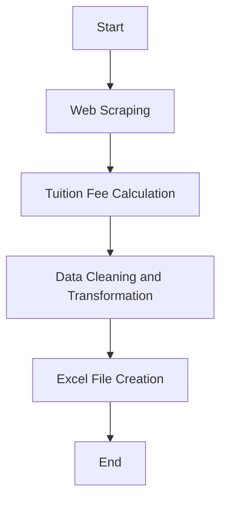

# Proposal for Extracting Information from 205 International Schools in Malaysia and Creating an Excel List

## 1. Proposal Overview
This proposal outlines a technical approach to extracting information from the official websites of 205 international schools in Malaysia, calculating tuition fees accurately, and compiling the data into an Excel list with both Japanese and English entries.

## 2. Technical Selection and Reasons
### Python Programming Language
- **Reason**: Python is highly versatile and has robust libraries for web scraping, data manipulation, and Excel file handling.
- **Libraries Used**:
  - `requests`: For making HTTP requests to the school websites.
  - `BeautifulSoup`: For parsing HTML content from the websites.
  - `pandas`: For data manipulation and exporting to Excel.

### Natural Language Processing (NLP)
- **Reason**: NLP will be used for translating English text into Japanese, ensuring accurate translations of school names and descriptions.
- **Library Used**:
  - `transformers` by Hugging Face: For state-of-the-art translation models.

## 3. Architecture Diagram

## 4. Development Approach
1. **Web Scraping**: Use Python's `requests` and `BeautifulSoup` libraries to scrape the official websites of the schools.
2. **Tuition Fee Calculation**:
   - Extract PDF files containing tuition fee information.
   - Parse the PDFs using appropriate libraries.
   - Calculate total fees by summing up different components (e.g., entrance fee, annual fee, etc.).
3. **Data Cleaning and Transformation**: Use `pandas` to clean and transform the data into a structured format suitable for Excel.
4. **Excel File Creation**:
   - Create an Excel file with tabs for Japanese and English entries.
   - Populate the tabs with school names, addresses, curricula, features, and translated descriptions.

## 5. Strengths of This Proposal
1. **Efficiency**: The use of Python and NLP libraries ensures that the process is automated and efficient, reducing manual errors.
2. **Accuracy**: Advanced NLP models will ensure accurate translations of school names and descriptions, maintaining the integrity of the data.
3. **Scalability**: The approach can be easily scaled to handle additional schools or different types of information as needed.

This proposal outlines a comprehensive technical solution for extracting and compiling international school information in Malaysia, ensuring that the data is both accurate and accessible.